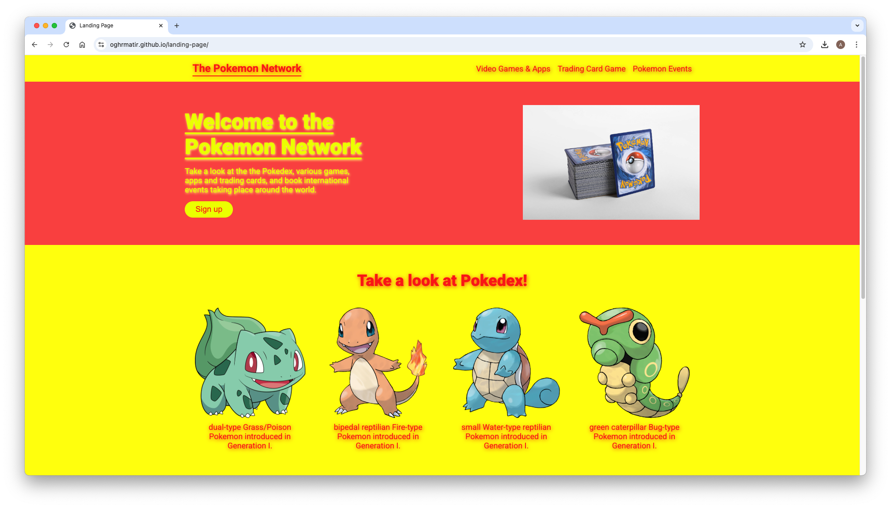

  <h1>Landing Page</h1>

  An Entire Web Page from a Design ([live preview](https://oghrmatir.github.io/landing-page/))

## About
`landing-page`[^1] showcases a landing page which was initially designed to create an entire web page from two design images (as per the project specifications) but later stylized to provide a unique personal touch inspired from the famous "Pokemon".

[^1]: This [project](https://www.theodinproject.com/lessons/foundations-landing-page) is from the [Foundations Course](https://www.theodinproject.com/paths/foundations/courses/foundations) of [The Odin Project](https://www.theodinproject.com/about).

## Showcase

  
  
This is a screenshot of the landing page.

  
  
This is a screenshot of the landing page.

  
  
This is a screen cast of the website.

## Technologies
- ***CLI***, ***Git***, ***HTML***, ***CSS***, ***GitHub***, ***GitHub Pages***

## Acknowledgements
- Credit to [ritaly's README-cheatsheet](https://github.com/ritaly/README-cheatsheet) and [ArjunSaili1's comment](https://github.com/TheOdinProject/curriculum/discussions/25472#discussioncomment-5889343) for README.
- Credit to [Bulbagarden's Bulbapedia](https://bulbapedia.bulbagarden.net/) for the other images and quote.
- Credit to [Giorgio Trovato](https://unsplash.com/@giorgiotrovato) for the banner image.

## Contact and Support
- Please do not hesitate to contact **oghrmatir_40617** on discord for project queries.
- This project will no longer be worked upon and no further support will be provided.[^2]

[^2]: The [TOP Strategy guide](https://dev.to/theodinproject/becoming-a-top-success-story-mindset-3dp2) makes it clear to [focus on the point of the assignment](https://dev.to/theodinproject/learning-code-f56#:~:text=Focus%20on%20the%20point%20of%20the%20assignment) and that [foundations isn't a strong portfolio generator](https://dev.to/theodinproject/learning-code-f56#:~:text=Foundations%20isn%E2%80%99t%20a%20strong%20portfolio%20generator) so no point in wasting too much time here.